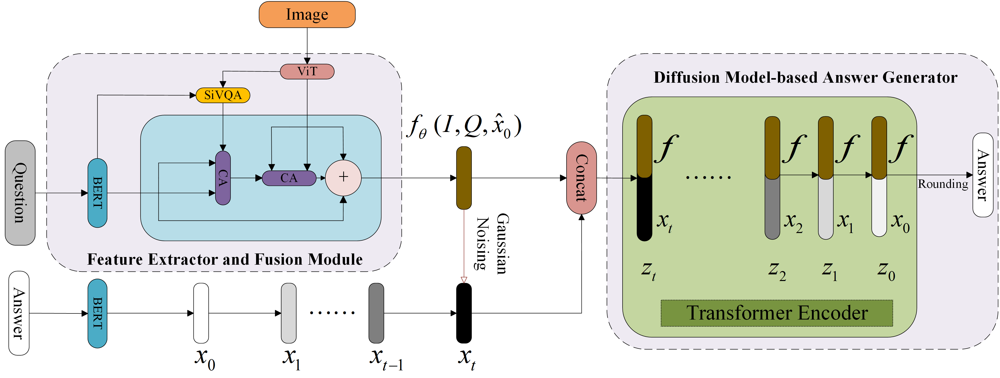

# **Redefining medical visual question answering using conditional generative diffusion models**
## Abstract
Medical Visual Question Answering (Med-VQA) aims to provide answers to clinical questions based on medical images, offering support in diagnostic decision-making. However, most existing methods frame this task as a classification problem, limiting outputs to predefined answers and lacking the ability to model complex, interpretable reasoning. In this work, we redefine Med-VQA as a conditional generative task and present DiffuVQA, a novel diffusion-based model that generates open-ended answers conditioned on multimodal information. DiffuVQA introduces two key strategies to enhance reasoning and contextual grounding. First, fused image-question features are embedded as conditional signals in the reverse diffusion process to guide answer generation. Second, to address the bias of reverse-only conditioning, we propose Conditional Information Gaussian Noising, which integrates the fused features into the forward process, enabling dual conditioning without altering the diffusion model’s probabilistic structure. Extensive experiments on three public Med-VQA datasets show that DiffuVQA achieves state-of-the-art performance compared to existing generative approaches, demonstrating superior flexibility, accuracy, and interpretability. Code is available at https://github.com/cloneiq/DiffuVQA
<div  align="center">    

</div>
The paper has been published in Biomedical Signal Processing and Control.

## Preparation
```bash
├── datasets
│   ├── slake
│   │   ├── images
│   │   ├── train.jsonl	
│   │   ├── valid.jsonl
│   │   ├── test.jsonl
├── diffuvqa
│   ├── config
│   ├── langua_encoder
│   ├── utils
│   ├── vison_encoder
├── scripts
```
## Setup:

The code is based on PyTorch and HuggingFace `transformers`.

```bash
pip install -r requirements.txt 
```

### Dataset

Please use the official datasets of [SLAKE](https://huggingface.co/datasets/BoKelvin/SLAKE), [Kvasir_VQA](https://huggingface.co/datasets/SushantGautam/kvasir-vqa), and [MedVQA 2019](https://huggingface.co/datasets/dineshcr7/MED-VQA-2019).

## DiffuVQA Training

```bash
cd scripts
bash train.sh
```

## Result
|                      |          |  Slake   |          |          |      |          | Kvasir-VQA |          |          |      |          | Med-VQA-2019 |          |          |
| :------------------: | :------: | :------: | :------: | :------: | :--: | :------: | :--------: | :------: | :------: | :--: | :------: | :----------: | :------: | :------: |
|                      |   BL1    |    RG    |    BS    |    F1    |      |   BL1    |     RG     |    BS    |   F1.    |      |   BL1    |      RG      |    BS    |   F1.    |
| MedFuseNet + Decoder |    -     |    -     |    -     |    -     |      |    -     |     -      |    -     |    -     |      |   27.6   |      -       |    -     |   22.9   |
|     LLaMA-3 (7B)     |    -     |    -     |    -     |    -     |      |   37.6   |    70.0    |    -     |    -     |      |    -     |      -       |    -     |    -     |
| Prefix T.Medical LM  |   78.6   |    -     |   91.2   |   78.1   |      |    -     |     -      |    -     |    -     |      |    -     |      -       |    -     |    -     |
|    DiffuVQA(Unc)     |   75.2   |   76.7   |   87.3   |   74.1   |      |   87.6   |    88.0    |   92.4   |   85.1   |      |   50.5   |     50.8     |   73.2   |   47.5   |
|    DiffuVQA(ConT)    |   80.2   |   81.2   |   89.4   |   78.4   |      |   90.2   |    90.8    |   95.0   |   86.7   |      |   54.5   |     55.1     |   75.0   |   52.5   |
|    DiffuVQA(ConN)    | **81.0** | **81.4** | **91.3** | **78.5** |      | **90.9** |  **91.7**  | **95.5** | **87.4** |      | **55.5** |   **56.5**   | **79.2** | **53.1** |

|            |          |  Slake   |          |
| :--------: | :------: | :------: | :------: |
|            | Open-set |  Yes/no  |   ALL    |
|    BAN     |   74.6   |   79.1   |   76.3   |
|  MEVF-BAN  |   77.8   |   79.8   |   78.6   |
| PubMedCLIP |   78.4   |   82.5   |   80.1   |
|    M2I2    |   74.7   | **91.1** |   81.2   |
|    LaPA    |   82.2   |   88.7   | **84.7** |
|  DiffuVQA  | **83.6** |   80.6   |   81.8   |

To reproduce the results  in our paper, you need to set up the following configuration:

```
python -m run_train.py --diff_steps 2000 --lr 0.00001 --learning_steps 150000 --save_interval 25000 --seed 105 --noise_schedule sqrt --hidden_dim 64 --bsz 64 --vocab bert --seq_len 64 --schedule_sampler lossaware
```

## Evaluation

You need to specify the folder of decoded texts. This folder should contain the decoded files from the same model but sampling with different random seeds.

```bash
cd scripts
python eval_DiffuVQA.py --folder ../{your-path-to-outputs} --mbr
```
